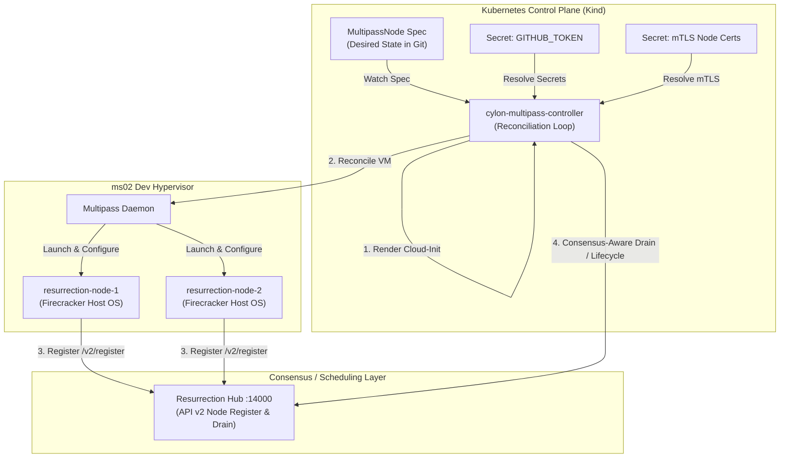

# 🧬 Cylon Regenesis

**Zero-Trust Infrastructure Regenesis and Declarative Hypervisor Control Plane for the Cylon Resurrection Platform (CRP)**

`cylon-regenesis` is the foundational infrastructure orchestrator and host manager for the Cylon Resurrection Platform. It manages the lifecycle of physical and virtual resurrection nodes (hosts for Firecracker microVMs), ensuring that they are dynamically provisioned, securely integrated into the consensus cluster, and healed of configuration drift.

---

## 💡 The Core Value Proposition: Why Cylon Regenesis?

Cylon Regenesis replaces legacy [Liquidmetal + Flintlock](https://github.com/liquidmetal-dev/flintlock) systems with a lean, modern, Rust-native control plane designed for high-density microVM environments.

### 1. Flintlock Replacement (Zero Containerd Bloat)
* **flintlock:** Relied on `containerd` namespaces, content stores, and heavy overlayfs snapshotters to pull and mount VM volumes.
* **Cylon Regenesis:** Decouples host management from containerd entirely. It uses a standalone OCI client ([oci.rs](file:///Users/casibbald/Workspace/remote/microscaler/cylon/crates/cylon/src/oci.rs)) to pull rootfs filesystems and packages ext4 images on the fly, drastically reducing virtualization overhead and host OS dependencies.

### 2. Declarative Infrastructure GitOps
Provision and configure physical and virtual hosts declaratively. In development, declare local virtual hypervisors via Kubernetes `MultipassNode` custom resources. In production, define physical bare-metal profiles integrated with `DCops` iPXE. The controller ensures the actual hypervisor fleet matches the desired state declared in Git.

### 3. Active Drift Auto-Remediation
Infrastructure allocation changes (CPU, RAM, disk, or configurations) are actively monitored. The self-healing engine acts on drift immediately:
* **Mutable Drift (CPU/RAM shifts):** Dynamically adjusts running VM specifications via hot-plugging or planned restarts.
* **Immutable Drift (Disk size/cloud-init changes):** Automatically tears down, purges, and reprovisions hosts to eliminate configuration drift.

### 4. Consensus-Aware Node Lifecycle
Coordination is handled through direct integration with the Resurrection Hub API. Infrastructure changes or node deletions trigger a consensus-aware node drain: running guest agents are gracefully migrated to alternative healthy nodes before host modifications occur.

---

## 🗺️ Role in the Ecosystem

Cylon Regenesis sits at the foundation of the Microscaler platform, orchestrating L0 (bare metal/iPXE) and L1 (virtual hypervisor) host systems. In development, it manages local Multipass nodes; in production, it integrates with `DCops` to provision physical hardware.



### 🧱 Layer Model & Architecture Boundaries

The Cylon platform is structured in a 6-layer model. `cylon-regenesis` owns the L0, L1, and L3 boundaries:

| Layer | Component | Responsibility | Repository / Crate |
| :--- | :--- | :--- | :--- |
| **L5 Guest** | `cylon-images` + `cylon-runtime` | Agent execution inside Firecracker microVMs | [`cylon-images`](https://github.com/microscaler/cylon-images) |
| **L4 Platform** | `cylon-daemon` + portal | Agent task allocation, chat interface, Postgres backlogs | [`cylon`](file:///Users/casibbald/Workspace/remote/microscaler/cylon) |
| **L3 Control Plane** | `regenesis-hub` | Raft consensus, scheduling, node registry, and agent placement | [Future Migration Target](file:///Users/casibbald/Workspace/remote/microscaler/cylon-regenesis/crates/) |
| **L2 Host Runtime** | `cylon-host-daemon` | OCI-to-ext4 rootfs packing, Firecracker UDS management, vsock proxies | [`cylon/crates/cylon`](file:///Users/casibbald/Workspace/remote/microscaler/cylon/crates/cylon) |
| **L1 Host Regenesis** | `regenesis-agent` + host images | Provisioning and configuring host OS dependencies, KVM, and systemd units | **cylon-regenesis** (This Repo) |
| **L0 Datacenter** | `DCops` | IPAM, DHCP, and bare-metal iPXE netboot delivery | [`DCops`](https://github.com/microscaler/DCops) |

> [!IMPORTANT]
> **A Critical Distinction — Two Kernels:**
> * **Host OS Kernel (`/boot/vmlinuz-*`):** Provisioned via iPXE/cloud-init. Runs the hypervisor, KVM, Multipass, and the Cylon host daemon.
> * **Firecracker Guest Kernel (`vmlinux`):** Pulled dynamically from GHCR (`cylon-kernel`). Executed directly by Firecracker inside the isolated guest agent microVMs.

---

## 🤖 The GitOps Node Controller (`cylon-multipass-controller`)

The core active component of this repository is the **`cylon-multipass-controller`**, a Kubernetes operator running inside the local management cluster (Kind). It reconciles custom `MultipassNode` resources against the local Multipass hypervisor on `ms02`, providing a local developer experience that mirrors bare-metal datacenter provisioning.

### 📄 Declarative Spec Example (`MultipassNode`)

```yaml
apiVersion: multipass.cylon.dev/v1alpha1
kind: MultipassNode
metadata:
  name: resurrection-node-1
  namespace: cylon-system
spec:
  cpus: 4
  memory: "8Gi"
  disk: "40Gi"
  image: "ubuntu-24.04"
  releasePin: "v0.1.2"
  githubTokenSecretRef:
    name: github-token-secret
    key: token
  certsSecretRef:
    name: mtls-certs-secret
  config:
    grpcEndpoint: "https://10.177.76.2:50052"
    hubApi: "http://resurrection-hub.cylon-system.svc.cluster.local:14000"
```

### ⚡ Technical Capabilities

* **Dynamic Cloud-Init Assembler:** Automatically resolves Github tokens and mTLS certificates from Kubernetes secrets, merging them into a single secure, environment-specific `cloud-init.yaml` passed to the VM on launch.
* **Active Drift Detection & Healing:** Constantly scrapes the active VM state (RAM, CPUs, disk allocation, and cloud-init config hashes) and compares it with the Kubernetes desired state:
  * **Mutable Drift (CPU or RAM mismatch):** Triggers a consensus-aware drain → stops the VM → modifies resources via hypervisor CLI → restarts VM.
  * **Immutable Drift (Disk size or cloud-init changes):** Triggers a consensus-aware drain → purges the VM entirely → launches a fresh instance from the updated config.
* **Consensus-Aware Deletion Lifecycle:** Intercepts Kubernetes deletion requests using K8s finalizers, executing a node drain inside the Cylon Resurrection Hub API to securely move running guest workloads before tearing down hypervisor resources.

---

## 📚 Navigation & Resources

For implementation details, development loops, and architectural decisions:

* [CONTRIBUTING.md](file:///Users/casibbald/Workspace/remote/microscaler/cylon-regenesis/CONTRIBUTING.md) — Directory layouts, coding standards, compiler lints, local `act` workflow commands, and developer SSH loops.
* [adrs/](file:///Users/casibbald/Workspace/remote/microscaler/cylon-regenesis/adrs/) — Architecture Decision Records documenting all core design decisions.
* [docs/](file:///Users/casibbald/Workspace/remote/microscaler/cylon-regenesis/docs/) — Complete product requirement documents, planning schedules, and master plans.
