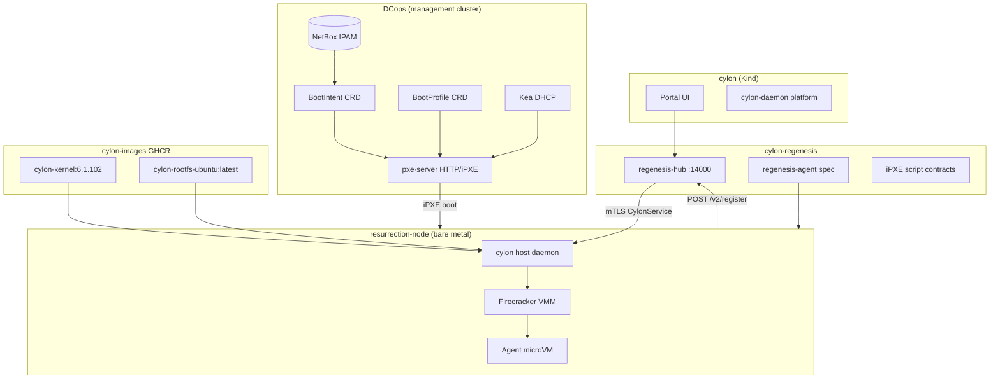

# Architecture — Cylon Regenesis

**Version:** 0.1 (design)  
**Status:** Pre-implementation — docs & ADRs only

## 1. Problem

CRP needs a **distributed Firecracker control plane** that:

1. Schedules agent microVMs across resurrection nodes with global consistency.
2. Survives host and network failures without split-brain agent execution.
3. **Regenerates** bare-metal hosts via iPXE when hardware is replaced or corrupted.
4. Integrates with existing Microscaler repos — not Flintlock, not Tinkerbell.

## 2. System context



## 3. Layer model

| Layer | Component | Responsibility |
|---|---|---|
| **L0 Datacenter** | DCops | IPAM, DHCP, iPXE delivery, BootIntent lifecycle |
| **L1 Host regenesis** | regenesis-agent + host OS image | Install Cylon host, Firecracker, guest kernel, systemd |
| **L2 Host runtime** | `cylon/crates/cylon` | OCI→ext4, Firecracker UDS, vsock proxy, detached watchdog |
| **L3 Control plane** | regenesis-hub | Raft, scheduling, API v2, resurrection orchestration |
| **L4 Platform** | cylon daemon + portal | Chat, executor, Postgres — not on resurrection nodes |
| **L5 Guest** | cylon-images + cylon-runtime | Agent loop inside microVM |

## 4. Critical distinction: two kernels

| Kernel | Path on node | Source | Purpose |
|---|---|---|---|
| **Host OS** | `/boot/vmlinuz-*` (installed) | iPXE netboot / autoinstall | Runs Cylon host daemon + KVM |
| **Firecracker guest** | `/home/cylon/cylon-images/vmlinux` | `ghcr.io/microscaler/cylon-kernel:6.1.102` | Passed to Firecracker for agent microVM |

Do not conflate DCops `BootProfile.kernel` (host boot) with GHCR guest `vmlinux`.

## 5. Control plane — regenesis hub

Migrates from `cylon/crates/resurrection-hub`. Core subsystems:

### 5.1 Raft state machine (Flintlock doc 01, 10)

- **Library:** OpenRaft (existing).
- **Replicated state:** `CylonNode` registry, `Agent` lifecycle, placement map, epoch counters.
- **Commands:** RegisterNode, CreateAgent, HibernateAgent, ResurrectAgent, MarkNodeOffline, RejoinNode, DrainNode.
- **Snapshots:** Periodic serialize of state machine; truncate log ([control-plane/raft-consensus.md](control-plane/raft-consensus.md)).

### 5.2 Scheduling (Flintlock doc 02, 08)

- Leader receives `POST /v2/agents`.
- Batch window 25–50ms → scatter **bid request** to healthy nodes.
- Nodes return `(available_vcpu, available_memory_mb, utilization_score)`.
- Leader picks minimum score → Raft commit placement → gRPC `CreateCylonVm` to winner.

### 5.3 API v2 + proxy (Flintlock doc 03)

| Endpoint | Behavior |
|---|---|
| `POST /v2/register` | New resurrection node — mTLS cert pin, capacity |
| `POST /v2/nodes/rejoin` | Partition recovery manifest exchange |
| `POST /v2/agents` | Create agent microVM |
| `GET /v2/agents/{id}` | Hub registry view |
| `GET /v2/agents/{id}/status` | **Proxy** to authoritative host gRPC |

v1 compatibility: none (not Flintlock).

### 5.4 Fault tolerance (Flintlock docs 04, 05, 07, 09)

See [control-plane/fault-tolerance.md](control-plane/fault-tolerance.md). Summary:

- Node heartbeats every 5s; 3 misses → `Offline`, zero capacity, reschedule agents from S3 snapshots.
- Host detached watchdog: 30s without Hub → hibernate/kill all microVMs.
- Rejoin: host sends local `vm_id` manifest; hub returns terminate/resume list.

### 5.5 Storage (Flintlock docs 12, 14)

- Agent memory+disk snapshots → S3 via `object_store`.
- CryoSleep TTL 7 days (configurable).
- Live migration: Phase 4+ — Firecracker memory pipe between hosts.

## 6. Host regenesis flow

See [host-regenesis/ipxe-provisioning.md](host-regenesis/ipxe-provisioning.md).

**Trigger events:**

- New bare-metal server in rack.
- Host marked `Detached` + `BootIntent.lifecycle` reset to `discovered`.
- RMA replacement (new MAC → new BootIntent).

**Outcome:** Host at `Installed` → `Locked`, registered in Hub, ready for bids.

## 7. Security (Flintlock doc 11)

| Link | Mechanism |
|---|---|
| Portal → Hub | mTLS (existing dev certs) |
| Hub → Cylon host | mTLS client cert per node |
| Cylon host → Hub | mTLS + node identity in SAN |
| Hub ↔ Raft peers | mTLS (in-cluster) |
| GHCR pulls | `GITHUB_TOKEN` / `RegistryAuth` (host env) |
| iPXE HTTP | TLS optional Phase 2; VLAN isolation Phase 1 lab |

## 8. Observability (Flintlock doc 13)

- Trace context: Hub HTTP → Raft commit → gRPC → Firecracker UDS ([control-plane/observability.md](control-plane/observability.md)).
- Metrics: `regenesis_hub_agents_total`, `regenesis_node_capacity`, `regenesis_bid_latency_ms`.
- Host: Prometheus scrape on `:8080/metrics` (cylon host extension).

## 9. Version matrix

| Component | Pin | Compatibility |
|---|---|---|
| regenesis-hub | semver from this repo | Requires `cylon.proto` ≥ X |
| cylon host | Cylon release tag (`/etc/cylon/release-pin`) | Matches hub gRPC schema |
| Guest rootfs | `ghcr.io/microscaler/cylon-rootfs-ubuntu:latest` | Skills registry baked at CI |
| Guest kernel | `ghcr.io/microscaler/cylon-kernel:6.1.102` | Firecracker 1.10.x |
| Host OS image | `regenesis-host-ubuntu-24.04:<tag>` | regenesis-agent ≥ same tag |
| DCops | `BootProfile` API `v1alpha1` | BootIntent lifecycle enum |

## 10. Deployment topology (target)

| Environment | Hub | Nodes | PXE |
|---|---|---|---|
| **ms02 dev** | Kind `:14000` | Multipass ×3 | cloud-init (Phase 1) |
| **ms02 lab** | Kind `:14000` | 1× bare metal | DCops iPXE (Phase 2) |
| **Production DC** | 3× regenesis-hub (Raft) | N× bare metal | DCops + Kea on mgmt VLAN |

## 11. Code layout (future)

```
cylon-regenesis/
├── crates/
│   ├── regenesis-hub/      # migrate from cylon
│   ├── regenesis-agent/    # first-boot CLI
│   └── regenesis-proto/    # optional — or depend on cylon host crate
├── ipxe/
│   ├── cylon-resurrection.ipxe
│   └── profiles/
├── images/
│   └── host-os/            # netboot/autoinstall build
├── docs/
└── adrs/
```

## 12. Open questions

> **Open:** DCops BootProfile for x86_64 Ubuntu autoinstall vs pre-baked squashfs netboot?  
> **Open:** regenesis-hub HA on Kind vs bare metal for production?  
> **Open:** GHCR anonymous pull on nodes vs embedded registry mirror?

Track in PRD and close via ADR supersession.
