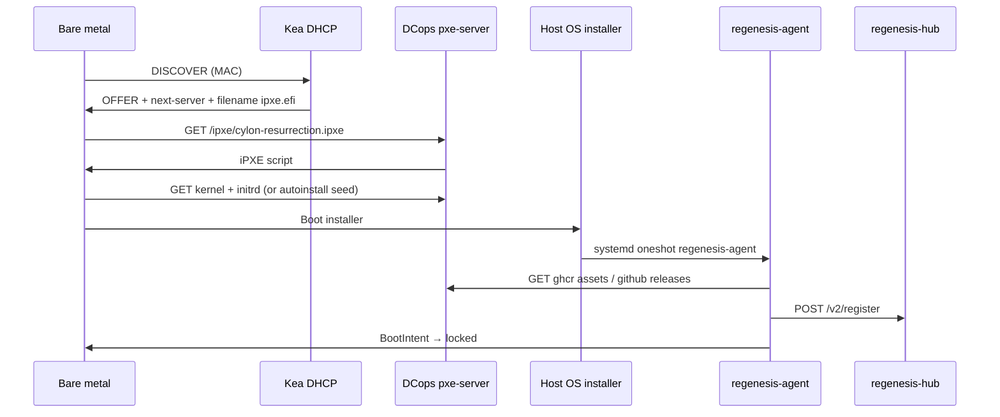

# iPXE provisioning — resurrection nodes

Standard **iPXE** boot chain for x86_64 bare-metal resurrection nodes. Orchestrated by **DCops** — not Tinkerbell.

## Network prerequisites

| Service | Owner | Phase |
|---|---|---|
| DHCP (options 66/67 or iPXE DHCP user class) | Kea via DCops | 2+ |
| HTTP boot file server | DCops `pxe-server` | 2+ |
| Management VLAN routing | Site network | 2+ |
| NetBox device + MAC inventory | DCops controllers | 2+ |

Phase 1 (Multipass) skips iPXE entirely — see [cloud-init-parity.md](cloud-init-parity.md).

## Boot flow



## iPXE script (canonical)

Future path: `cylon-regenesis/ipxe/cylon-resurrection.ipxe`

```ipxe
#!ipxe
# Cylon resurrection node — standard iPXE
# Variables injected by DCops BootProfile or query string

dhcp
set base-url http://${next-server}:${port}/cylon-regenesis/${profile}

echo Cylon Regenesis — profile ${profile}
kernel ${base-url}/vmlinuz initrd=initrd.img \
  ip=dhcp \
  autoinstall ds=nocloud-net;s=${base-url}/autoinstall/ \
  regenesis.profile=${profile} \
  regenesis.hub=${hub_url} \
  ---
initrd ${base-url}/initrd.img
boot
```

### Profile variants

| Profile | Use case | kernel/initrd source |
|---|---|---|
| `ubuntu-24.04-autoinstall` | Default bare metal | Ubuntu netboot + cloud-init datasource |
| `ubuntu-24.04-live` | Lab debug | Live server + manual regenesis-agent |
| `regenesis-maintenance` | Re-provision locked node | Requires BootIntent lifecycle reset |

## HTTP artifact layout (pxe-server)

```
/cylon-regenesis/
├── cylon-resurrection.ipxe          # entry script
├── profiles/
│   └── ubuntu-24.04-autoinstall/
│       ├── vmlinuz
│       ├── initrd.img
│       └── autoinstall/
│           ├── meta-data
│           └── user-data            # calls regenesis-agent
└── regenesis-agent/
    └── regenesis-agent-linux-x86_64 # GitHub release binary
```

Served by DCops `pxe-server` HTTP module ([DCops `crates/pxe-server/src/http.rs`](../../../DCops/crates/pxe-server/src/http.rs)).

## BootProfile CRD example

```yaml
apiVersion: dcops.microscaler.io/v1alpha1
kind: BootProfile
metadata:
  name: cylon-resurrection-ubuntu-2404
  namespace: cylon-regenesis
spec:
  kernel: http://pxe.mgmt.example/cylon-regenesis/profiles/ubuntu-24.04-autoinstall/vmlinuz
  initrd:
    - http://pxe.mgmt.example/cylon-regenesis/profiles/ubuntu-24.04-autoinstall/initrd.img
  cmdline: >-
    ip=dhcp autoinstall ds=nocloud-net;s=http://pxe.mgmt.example/cylon-regenesis/profiles/ubuntu-24.04-autoinstall/autoinstall/
    regenesis.profile=ubuntu-24.04-autoinstall
  message: Cylon resurrection node — Ubuntu 24.04 autoinstall
```

## BootIntent CRD example

```yaml
apiVersion: dcops.microscaler.io/v1alpha1
kind: BootIntent
metadata:
  name: resurrection-rack1-u42
  namespace: cylon-regenesis
spec:
  macAddress: "aa:bb:cc:dd:ee:ff"
  profileRef:
    name: cylon-resurrection-ubuntu-2404
  lifecycle: discovered   # → installing → installed → locked
```

## Lifecycle state machine

| State | Meaning | iPXE behavior |
|---|---|---|
| `discovered` | MAC known, allow netboot | Serve full install script |
| `installing` | Install in progress | Same (idempotent autoinstall) |
| `installed` | regenesis-agent succeeded | Chain to local disk OR block netboot |
| `locked` | Production — no reinstall | HTTP 403 or boot local only |

Transition `installed → locked` is triggered by regenesis-agent callback (future DCops API) or manual GitOps commit.

## Guest vs host artifacts (again)

| Artifact | Delivered by iPXE? |
|---|---|
| Host Ubuntu OS | **Yes** |
| Firecracker binary | **No** — regenesis-agent |
| Cylon host daemon | **No** — regenesis-agent from GitHub Releases |
| Guest `vmlinux` | **No** — regenesis-agent pulls GHCR |
| Guest OCI rootfs | **No** — hub at `CreateCylonVm` |

## Security

- Phase 2 lab: HTTP on isolated VLAN acceptable.
- Production: HTTPS boot (`cert`) or TLS-terminated reverse proxy in front of pxe-server.
- `user-data` may embed **hashed** join tokens — not long-lived PATs in Git.

## Testing checklist

- [ ] iPXE chainloads on UEFI + legacy BIOS lab box
- [ ] DHCP reservation matches BootIntent MAC
- [ ] Autoinstall completes unattended
- [ ] regenesis-agent registers with Kind hub
- [ ] BootIntent reaches `locked`
- [ ] Second PXE boot does not reinstall

## References

- [dcops-integration.md](dcops-integration.md)
- [first-boot-sequence.md](first-boot-sequence.md)
- ADR-0003
