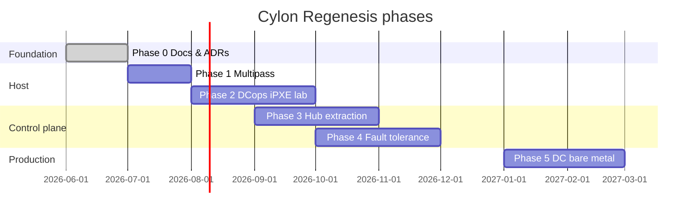

# Implementation phases

Roadmap from documentation to production bare-metal resurrection fleet.

## Phase summary

| Phase | Doc | Deliverable |
|---|---|---|
| **0** | [phase-0](phase-0-docs-and-contracts.md) | ADRs, ARCHITECTURE, PRD, mappings |
| **1** | [phase-1](phase-1-multipass-parity.md) | regenesis-agent on Multipass |
| **2** | [phase-2](phase-2-dcops-ipxe-dev.md) | Lab server boots via DCops iPXE |
| **3** | [phase-3](phase-3-control-plane-extraction.md) | regenesis-hub crate in this repo |
| **4** | [phase-4](phase-4-fault-tolerance.md) | Chaos-tested resilience |
| **5** | [phase-5](phase-5-production-bare-metal.md) | Production DC rollout |

## Parallel workstreams

| Stream | Can proceed independently |
|---|---|
| Host regenesis | Phase 1–2 while hub still in cylon |
| Control plane | Phase 3–4 |
| Guest images | cylon-images (always) |
| DCops PXE HTTP | DCops crate maturity |

## Exit gate

Each phase requires:

1. Acceptance criteria in phase doc — all checked
2. Runbook in phase doc — reviewed
3. Cylon llmwiki log entry (cross-repo)
