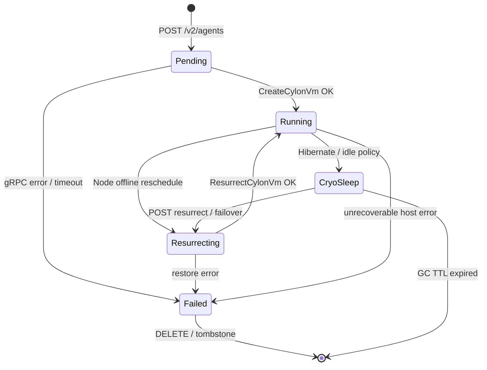
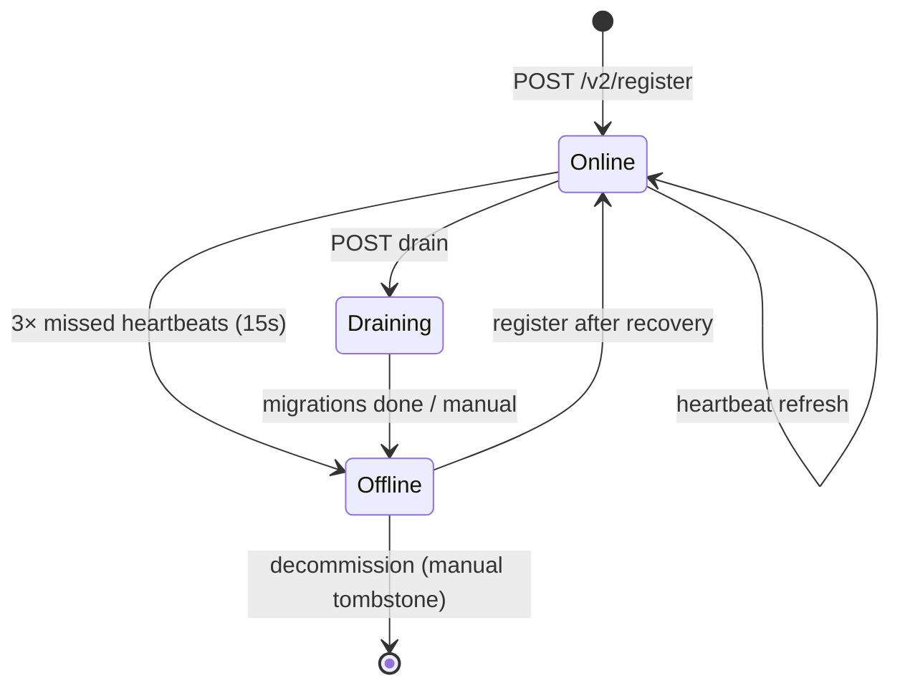
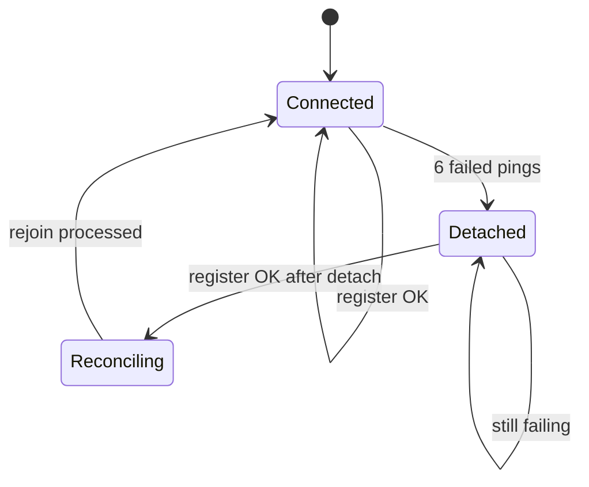
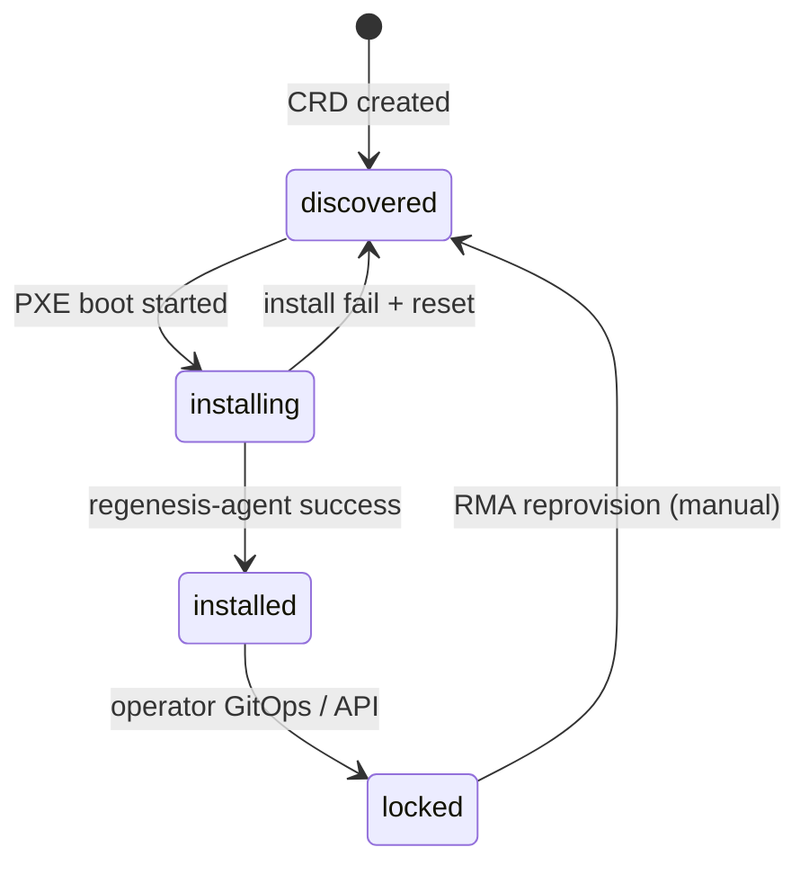
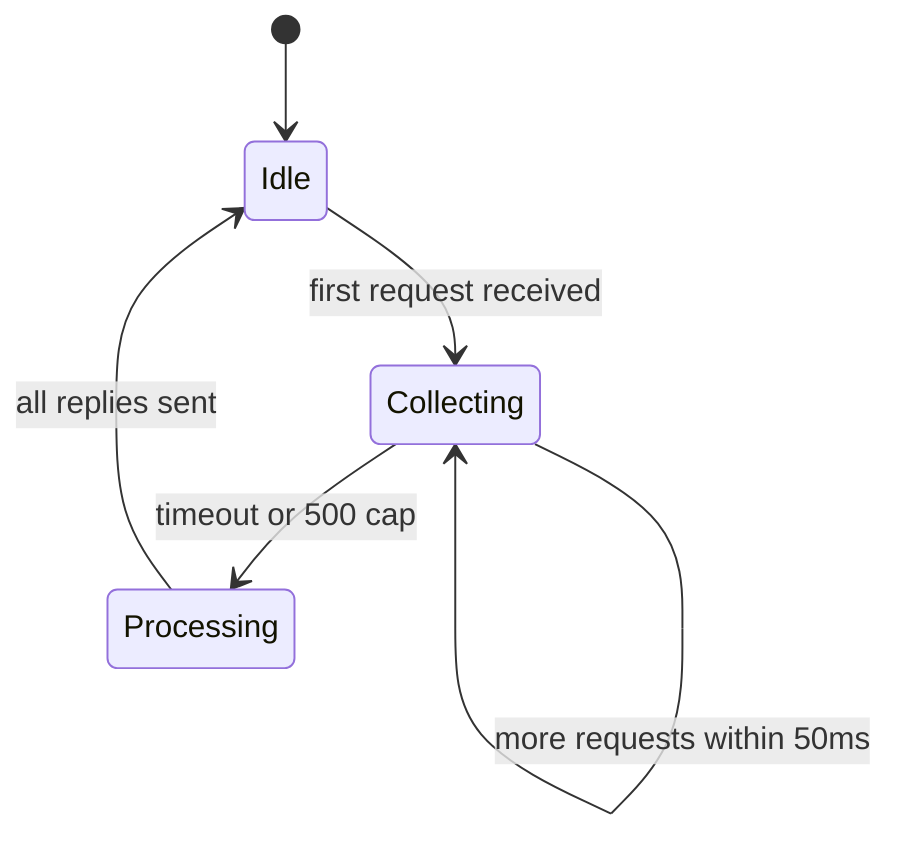
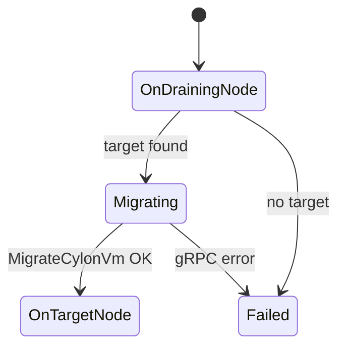

# 05 — State machines

## Agent lifecycle (hub)

### Transition table

| From | Event | To | Actor |
|---|---|---|---|
| — | create accepted | Pending | Hub |
| Pending | CreateCylonVm OK | Running | Hub |
| Pending | CreateCylonVm fail | Failed | Hub |
| Running | HibernateCylonVm | CryoSleep | Hub |
| Running | node Offline | Resurrecting | Hub leader |
| CryoSleep | ResurrectCylonVm | Resurrecting | Hub |
| Resurrecting | restore OK | Running | Hub |
| CryoSleep | TTL 7d | tombstone | Hub GC loop |
| Running | drain migrate | Running (new node) | Hub |

---

## CylonNode lifecycle (hub)

### Heartbeat timing

| Parameter | Value | Source |
|---|---|---|
| Host ping interval | 5s | cylon main.rs |
| Hub offline threshold | 15s (`last_heartbeat + 15`) | hub main.rs |
| Host detach threshold | 30s (6 failed pings) | cylon main.rs |

**Note:** Host uses `POST /v2/register` as heartbeat; hub updates `last_heartbeat` each success.

---

## Host connection lifecycle (cylon watchdog)

### Detached Mode actions

1. Enumerate `/tmp/firecracker-*.sock`
2. `pause_instance()` each VM (async spawn)
3. Disable egress proxy (target — partial today)
4. Set `in_detached_mode = true`

### Rejoin actions

1. Collect active vm_ids from UDS filenames
2. `POST /v2/nodes/rejoin`
3. For each kill_vm_id: DeleteCylonVm (**target**) / UDS rm (today)
4. Clear detached flag

---

## BootIntent lifecycle (DCops)

### iPXE gate rules

| lifecycle | pxe-server behavior |
|---|---|
| `discovered` | Serve full install script |
| `installing` | Serve install (idempotent autoinstall) |
| `installed` | Chain `sanboot --no-describe --drive 0x80` OR local boot only |
| `locked` | HTTP 403 on install artifacts OR local boot only |

---

## Allocator batch cycle

Per-request outcome: `Ok(CylonNode)` | `Err("No Cylon nodes available...")`

---

## Drain migration (per agent)

Hub updates `allocated_node_id` in Raft on success.
