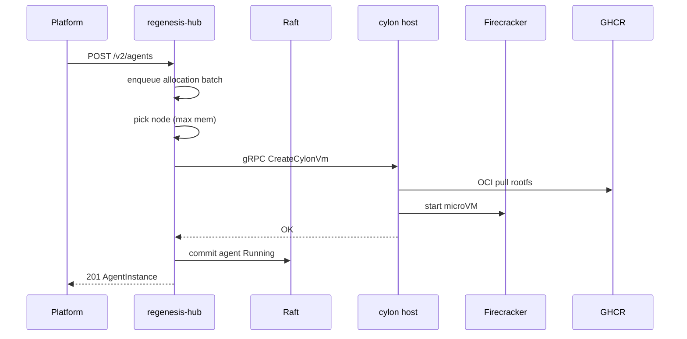
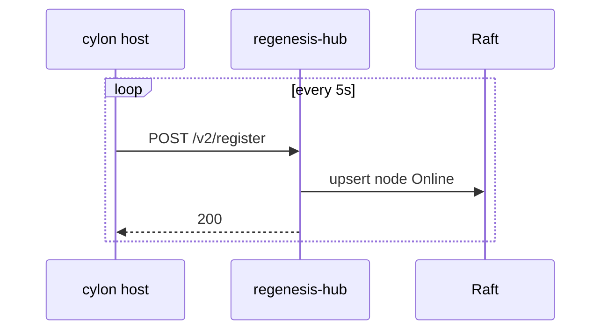
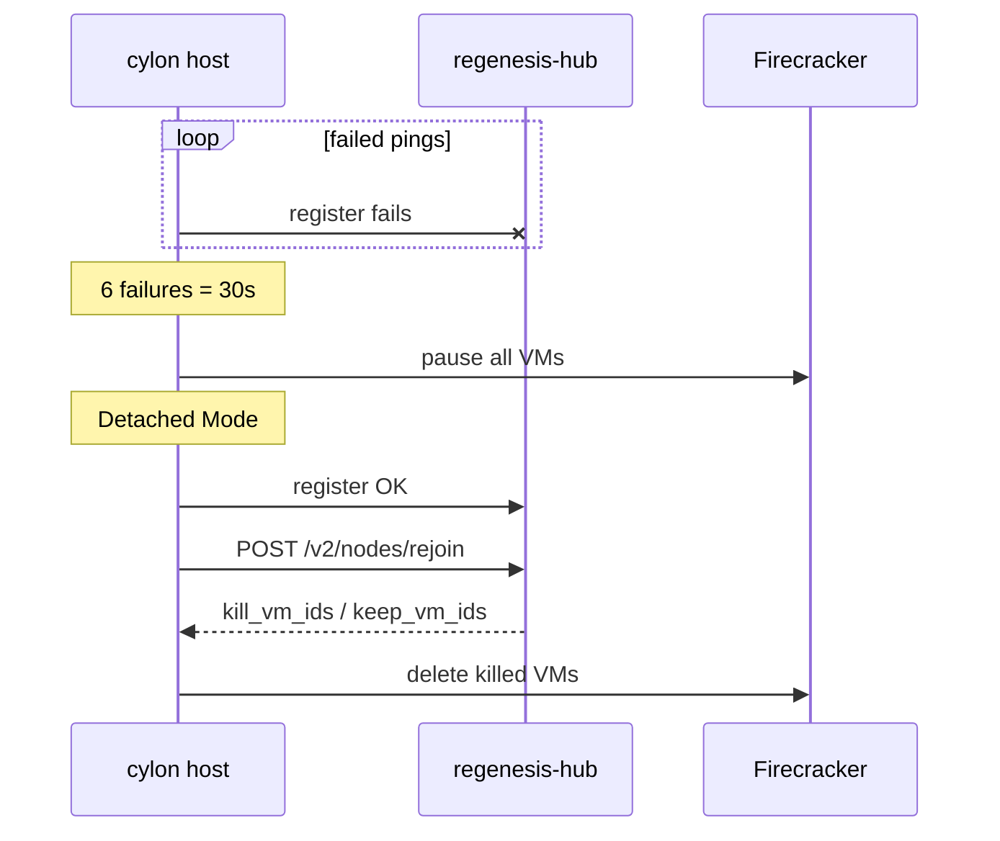
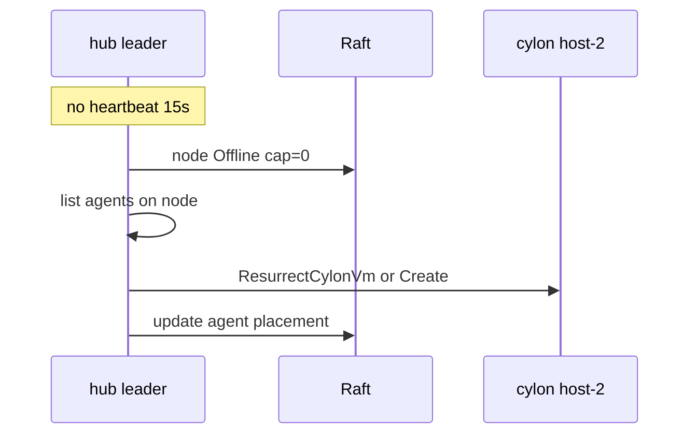
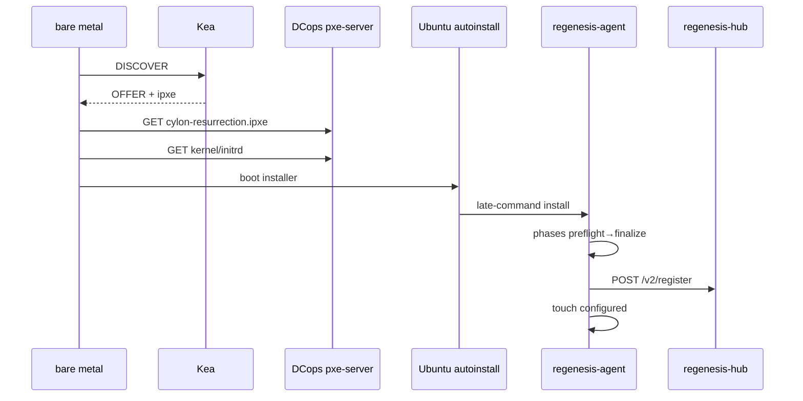
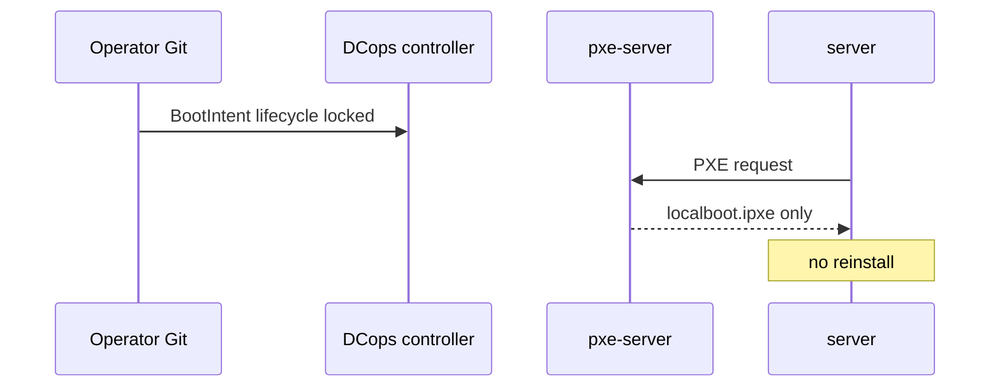
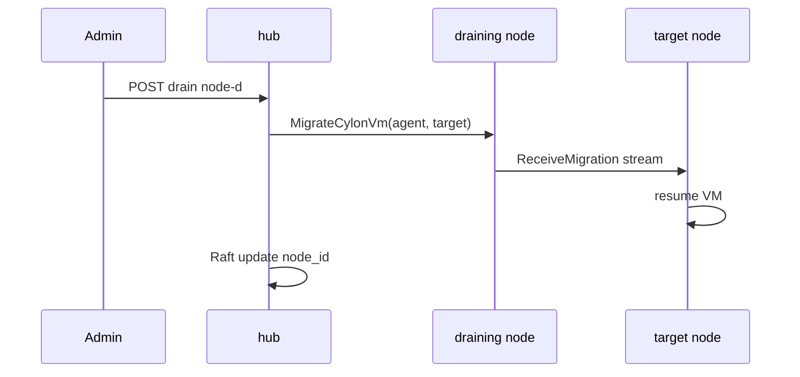

# 14 — Sequence diagrams

## SD-01 Agent create (happy path)

## SD-02 Node registration heartbeat

## SD-03 Detached mode

## SD-04 Hub marks node offline

## SD-05 iPXE bare metal regenesis

## SD-06 BootIntent lock

## SD-07 Drain migration (target)

