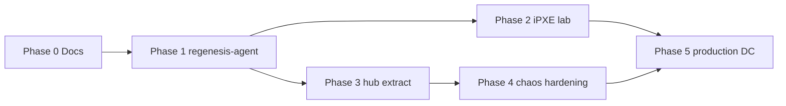

# Master plan — Cylon Regenesis

**Version:** 1.0  
**Date:** 2026-06-13  
**Status:** Authoritative planning corpus (pre-implementation)

This document indexes the **excruciating-detail** planning set. Read in order for onboarding; jump by number for deep dives.

## Reading order

| # | Document | What you get |
|---|---|---|
| 01 | [Vision & principles](01-vision-and-principles.md) | Why regenesis exists, design tenets |
| 02 | [Gap analysis — current state](02-gap-analysis-current-state.md) | What cylon already implements vs missing |
| 03 | [Data model](03-data-model.md) | Every entity, field, index, tombstone rules |
| 04 | [API contract](04-api-contract.md) | HTTP `/v2`, gRPC, error codes, examples |
| 05 | [State machines](05-state-machines.md) | Agent, node, boot intent transitions |
| 06 | [regenesis-agent spec](06-regenesis-agent-spec.md) | First-boot program — step-by-step |
| 07 | [iPXE + DCops spec](07-ipxe-dcops-spec.md) | Boot chain, CRDs, HTTP layout, blockers |
| 08 | [Control plane internals](08-control-plane-internals.md) | Raft, allocator, loops — mapped to code |
| 09 | [Cylon host contract](09-cylon-host-contract.md) | What stays in cylon/crates/cylon |
| 10 | [Security model](10-security-model.md) | mTLS, tokens, trust boundaries |
| 11 | [Testing & chaos](11-testing-and-chaos.md) | Test matrix, harness, acceptance |
| 12 | [Configuration reference](12-configuration-reference.md) | Every env var, file path, default |
| 13 | [Work breakdown structure](13-work-breakdown-structure.md) | Epics → tasks → IDs → deps |
| 14 | [Sequence diagrams](14-sequence-diagrams.md) | End-to-end flows (mermaid) |
| 15 | [Operational runbooks](15-operational-runbooks.md) | Replace rack, drain, rollback |

## Related (higher level)

- [ARCHITECTURE.md](../ARCHITECTURE.md) — system context
- [PRD.md](../PRD.md) — requirements & phase gates
- [phases/](../phases/) — phase exit criteria
- [adrs/](../../adrs/) — locked decisions

## Implementation sequence (summary)

**Critical path:** regenesis-agent (P1) ∥ hub extraction (P3) → iPXE (P2) blocked on DCops `pxe-server` HTTP.

## Open decisions log

| ID | Question | Default | Decide by |
|---|---|---|---|
| OQ-1 | Ubuntu autoinstall vs pre-baked squashfs netboot | autoinstall | Phase 2 start |
| OQ-2 | `regenesis-agent` Rust vs shell Phase 1 | shell → Rust | Phase 1a |
| OQ-3 | Hub HA on Kind vs bare metal prod | Kind dev / 3× prod | Phase 5 |
| OQ-4 | GHCR auth on nodes — token vs mirror | token + crane | Phase 1 |
| OQ-5 | BootIntent `locked` transition — GitOps vs API | GitOps commit | Phase 2 |

Track closures in new ADRs.
